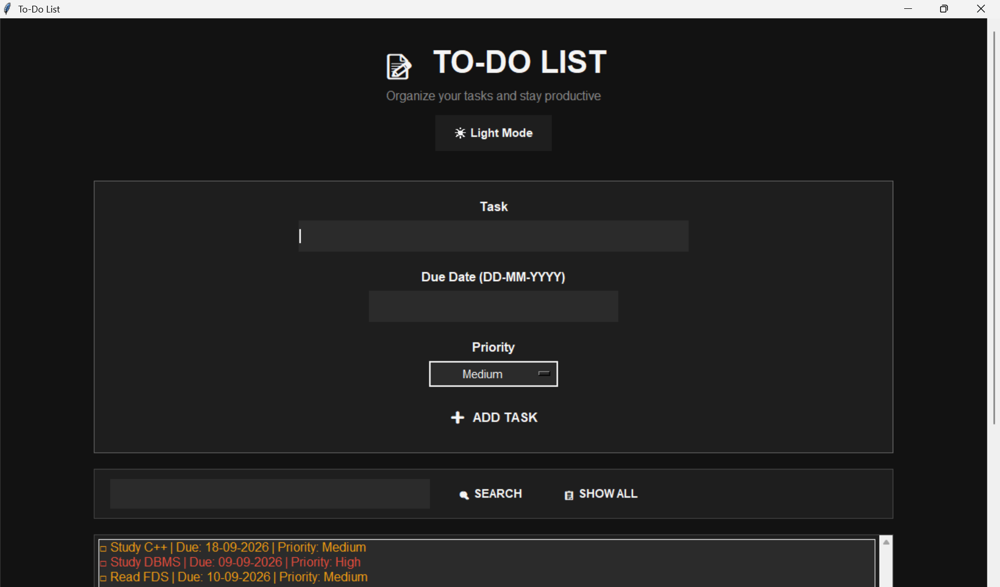

📝 Smart To-Do List 

A professional desktop To-Do List application built using Python, Tkinter, and JSON.

## 📸 Project Screenshot

✨ Features

- ➕ Add new tasks
- 📅 Due Date support
- 🚦 Priority (High / Medium / Low)
- ☑️ Mark tasks as completed
- 🗑️ Delete tasks
- 🧹 Clear all tasks
- 🔍 Search tasks
- 🌙 Dark Mode / Light Mode
- 💾 Automatically saves tasks using JSON
- 📜 Scrollable interface

🛠️ Technologies Used

- Python
- Tkinter
- JSON

▶️ How to Run

1. Download the project.
2. Open Terminal in the project folder.
3. Run:

python todo.py

📌 Future Improvements

- Calendar view
- Task reminders
- Categories
- Export tasks to PDF

---

Made by Bathmapriya M
